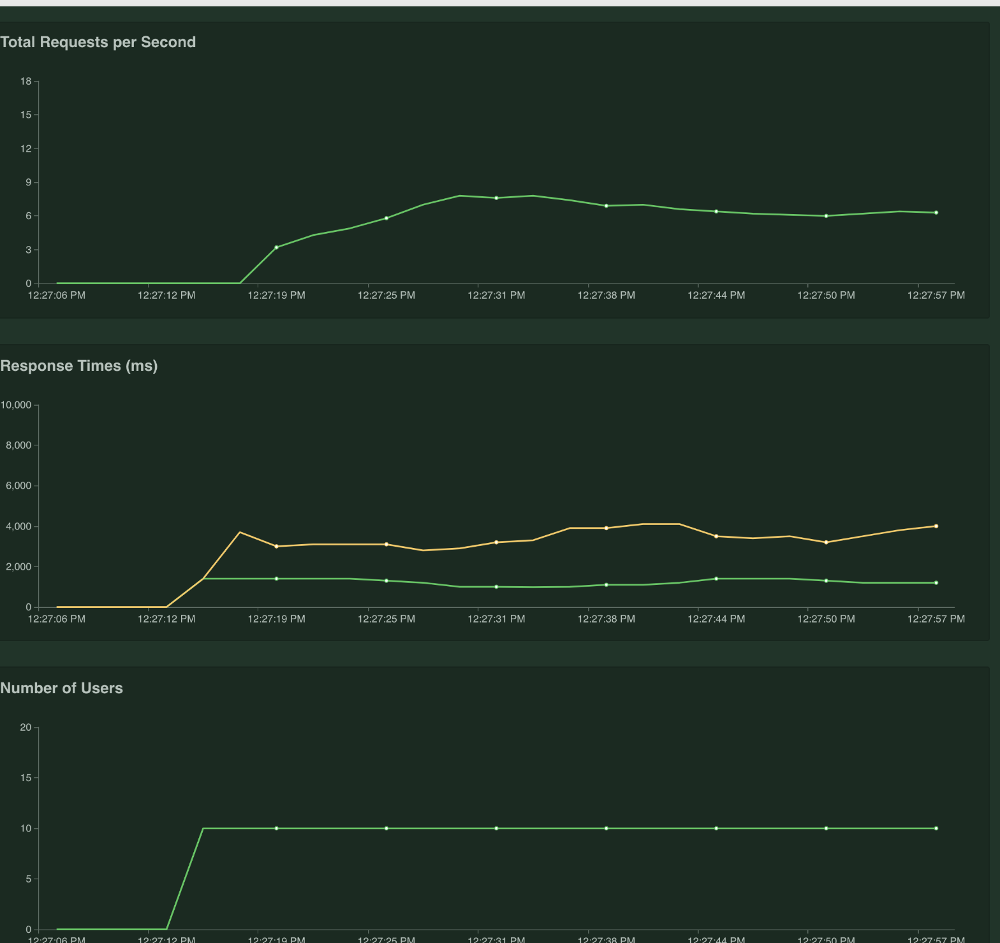

# Opinions-Scrapper

Fully asynchronous rest api that scrappes any opinoin from https://www.debate.org/opinions/.

How to Run:

```docker run -it -p 5000:5000 $(docker build -q .) ```

Usage:

```shell
curl --header "Content-Type: application/json" --request POST \
--data '{"url":"http://www.debate.org/opinions/should-drug-users-be-put-in-prison"}' \
http://localhost:5000/opinion_scraper
```

## Performance:

#### Average latency is 715ms for requests having short and long opinions.


#### Average throughput is 6.4 req/s for 10 concurrent users calling the endpoint with an average response time of 1.5s.
#### Tests are run on a 4 Core machine running 4 sanic workers. It scales horizantally nicely with a 1.5x factor.





